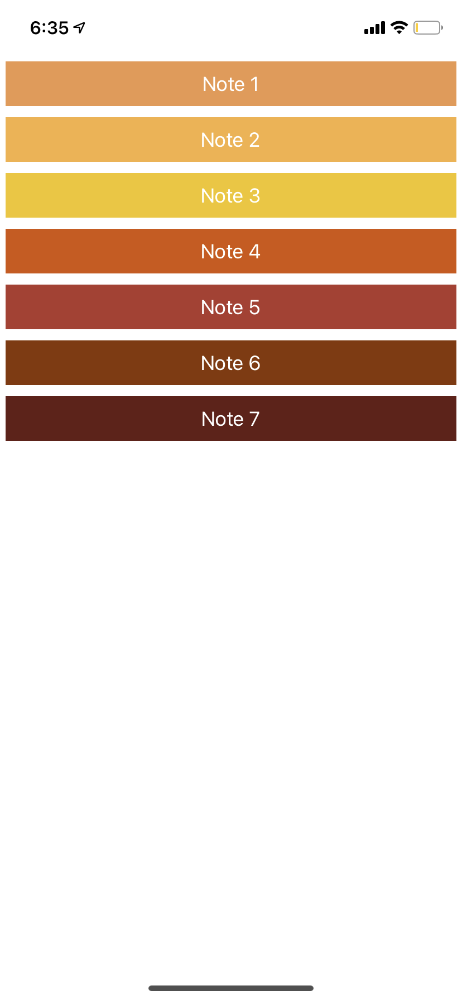

# Hack Technology / Project Attempted

React Native and Playing Audio on a mobile app

## What you built? 

We built a xylophone iOS app with React Native, Expo, and the Audio class from the 'expo-av' package.

Here is a screenshot of what the app looks like:

## Who Did What?

Sathvi added the paths to the audio files and created buttons that plays the sound for the note when pressed.
Gia did the styling, put in the audio files, and added functionality to play the audio files.

## What you learned

We learned how to use Expo and React Native and also learned that that the expo-av package provides the functionality to play audio files! We had some merging issues with git flow but we fixed it (shout out to git rebase). Figuring out how to fix the problem was a nice practice that helped us get back into the flow of using git. From this hack, we see that we can definitely do something music-related or sound-related on a phone screen, which could be cool for making something with an interactive, instrument-like interface (compared to something similar with buttons on a computer screen).

## Authors

Gia Kim, Sathvi Korandla

## Acknowledgments

https://heartbeat.fritz.ai/how-to-build-a-xylophone-app-with-audio-api-react-native-and-expo-7d6754a0603c

https://docs.expo.dev/versions/v42.0.0/sdk/audio/
