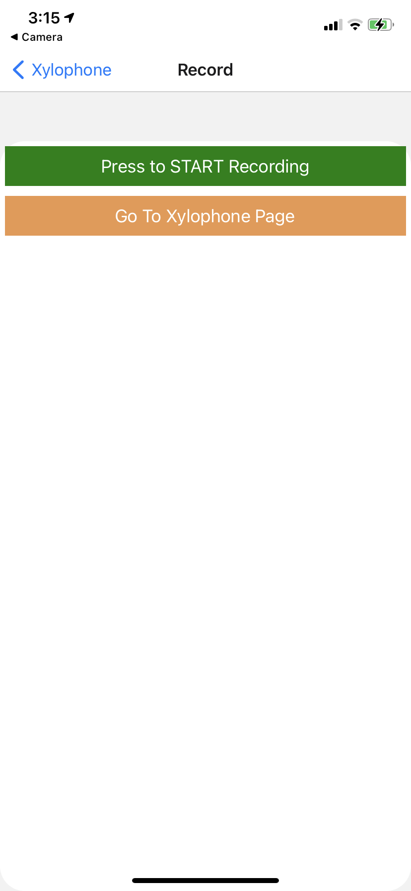

# Hack Technology / Project Attempted

React Native, Playing and Recording Audio on a mobile app

## What you built? 

We built a xylophone iOS app with React Native, Expo, and the Audio class from the 'expo-av' package. We also added functionality to recording what you play on the xylophone and also functionality to record your own voice using your phone microphone.

Here are screenshots of what the app looks like:

## Who Did What?

Sathvi and Gia pair programmed to add the recording functionality for the xylophone page, and we each did half of the recording voice part.

## What you learned

We learned how to use the expo-av package for recording functionality and how to playback audio files! We had some issues with getting the recorded voice to be played back to the user, but we were at least able to pinpoint where the issue was (the issue was with loading the URI where the recording is stored into a sound object). From this hack, we see that we can definitely do something audio recording-related using phones, which such as an app that analyzes recorded audio/other sounds. We also learned more about react hooks and using states using hooks instead of through classes.

## Authors

Gia Kim, Sathvi Korandla

## Acknowledgments

https://heartbeat.fritz.ai/how-to-build-a-xylophone-app-with-audio-api-react-native-and-expo-7d6754a0603c
https://docs.expo.dev/versions/v42.0.0/sdk/audio/
https://www.smashingmagazine.com/2018/04/audio-video-recording-react-native-expo/
https://docs.expo.dev/versions/latest/sdk/audio/
https://reactnative.dev/docs/navigation 
https://reactjs.org/docs/hooks-state.html
